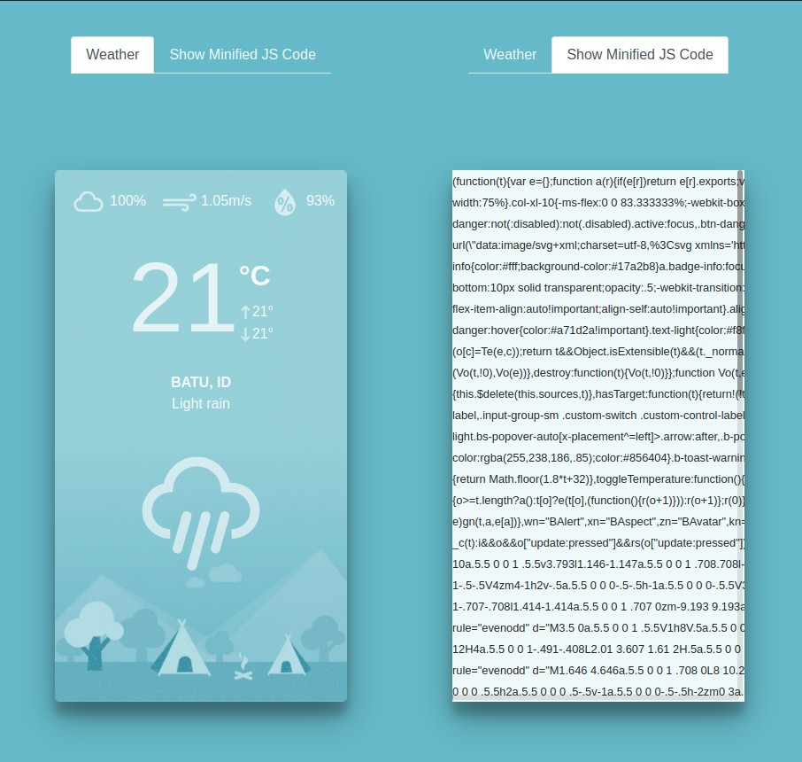

# SRDOSBv1 Progressive Weather App

## Overview
SRDOSBv1 Progressive Weather App is based on Progressive Weather App project initiated by [Jim Merioles](https://github.com/jimmerioles) which you can find in this [repository](https://github.com/jimmerioles/progressive-weather-app).


---

## What this repository covers
- [x] Containerize the Progressive Weather App with a little modification.
- [x] Build it with Jenkins cluster on Kubernetes.
- [x] Combine the required css and javascript from apps and vendor as a single optimized file.
- [x] Add Vue router to access the combined file over the internet.


## Prerequisites
---
Environment used during development are as follow:
1. Node.js version v12.19.0</br>
   Refer to this [link](https://nodejs.org/en/download/) for how to get Node.js
2. Docker version 19.03.8</br>
   Refer to this [link](https://docs.docker.com/engine/install/) for how to get Docker engine up and running
3. Kubernetes version 1.17.9</br>
   Refer to this [link](https://kubernetes.io/docs/setup/) for setting up Kubernetes installation (while we are using [Minikube](https://kubernetes.io/docs/tasks/tools/install-minikube/) during development.
4. GNU Make 4.2.1</br>
   Refer to this [link](https://www.gnu.org/software/make/) to get more informations about GNU Make
5. Docker-compose version 1.25.5</br>
   Refer to this [link](https://docs.docker.com/compose/install/) to get more informations about docker-compose.
6. Ansible version 2.9.6
   Please visit [Ansible Documentation](https://docs.ansible.com/ansible/latest/installation_guide/intro_installation.html) page.


## Getting Started
---

### Clone the repository
Clone the repository from the following location:
```
https://github.com/ermusthofa/srdosb.git
```

### Adjust the Configuration
Before you can deploy this application into any VM in the cloud, you need to adjust the application configuration in `progressive-weather-app`. Open `jenkins-config.json` file and edit the environment value to match with your environment. Make sure your AWS S3 Bucket is accessible from public and set the CORS to match your needs.

Also, make adjusment in `ansible` directory, inside `ansible_plugin` open `srdosb_aws_ec2.yaml` and adjust the `regions`.

This ansible plugins configuration assumes you have AWS EC2 instance with tag `Application: weather`. You can also edit the `filters` and `keyed_groups` if you have tag other than that. But, you need to make sure to adjust the `Jenkinsfile` in the `Deploy to VM` stage which tag you use as `passed_in_hosts` value.

Last but not least, adjust `ansible/deploy-progressive-weather.yaml`. You can adjust the `remote_user` and `become_user` to match with your environment.

Push this code to public repository.


## Deploy Jenkins on Kubernetes
---
This repository is included with preconfigured yaml manifest for Jenkins deployment.

1. Adjust these variables in `jenkins/03_configmap_jenkins-config.yaml` file:
   - `SRDOSB_CODE_COMMIT_SOURCE_URL`, adjust with your public repository in earlier step.
   - `AWS_ACCESS_KEY`
   - `AWS_SECRET_KEY`
   - `TARGET_VM_PRIVATE_KEY`
   
   The `TARGET_VM_PRIVATE_KEY` should be in base64 format. Please be caution, add a new line at the end of your private key before you encode it.
   
2. Deploy this manifest into Kubernetes cluster from project root directory with `kubectl deploy -f jenkins/`. Jenkins may take some time to bootup. It will wait until the plugins installation finish before it can be used.

3. This Jenkins yaml manifest is not bundled with any Kubernetes object to expose its service. You need to do port forward to access it by using `kubectl port-forward -n jenkins-build svc/jenkins 8080:8080`, and then navigate to your browser and visit `localhost:8080`.
   
4. Use `admin/admin` as `user/password` credentials. You can change this in `jenkins/04_secret_jenkins-envar.yaml` using base64 format.

This jenkins is using automatic polling every `1 minute`, eventually, you will see your pipeline running within this jenkins.